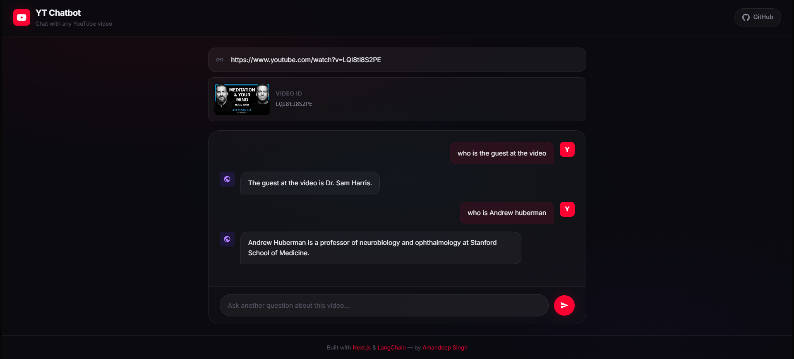

# YouTube Chatbot 🎥💬

An interactive chat application that allows users to chat with any YouTube video. The application automatically fetches the video transcript, chunks and embeds the text using OpenAI Embeddings, stores it in a FAISS vector database, and uses a LangChain RAG (Retrieval-Augmented Generation) pipeline to answer user queries based strictly on the video's transcript.



## Features

- **Premium Dark UI**: A sleek, modern glassmorphic interface with smooth micro-animations.
- **YouTube URL Parsing & Preview**: Automatically extracts video ID and shows a thumbnail preview of the video when a link is pasted.
- **Real-time Streaming/Loading State**: Displays a loading skeleton/indicator while fetching and processing answers.
- **Modular Architecture**: Clean separation of concerns between Frontend (Next.js) and Backend (FastAPI + LangChain).
- **RAG Pipeline**: Embedded using OpenAI (`text-embedding-3-small`) and queried via FAISS similarity search.

---

## Tech Stack

### Frontend
- **Framework**: [Next.js](https://nextjs.org/) (App Router, TypeScript)
- **Styling**: Vanilla CSS (Premium theme defined in `app/globals.css`)
- **Forms**: `react-hook-form`
- **Code Style**: Prettier

### Backend
- **Framework**: [FastAPI](https://fastapi.tiangolo.com/)
- **Orchestration**: [LangChain](https://python.langchain.com/)
- **Vector Database**: [FAISS](https://github.com/facebookresearch/faiss)
- **LLM / Embeddings**: OpenAI (`gpt-4o`/`text-embedding-3-small`)

---

## Getting Started

### Prerequisites
- Node.js (v18+)
- Python 3.10+
- OpenAI API Key

### Setup

1. **Clone the repository:**
   ```bash
   git clone https://github.com/amandeep-singh-parihar/yt_chatbot.git
   cd yt_chatbot
   ```

2. **Configure Environment Variables:**
   Copy the example environment file and add your API keys:
   ```bash
   cp .env.example .env
   ```
   Edit `.env` and provide your `OPENAI_API_KEY`.

### Frontend Installation & Run

1. **Install dependencies:**
   ```bash
   npm install
   ```

2. **Run the development server:**
   ```bash
   npm run dev
   ```
   Open [http://localhost:3000](http://localhost:3000) to view the application.

### Backend Installation & Run

1. **Navigate to the server directory and create a virtual environment:**
   ```bash
   cd server
   python -m venv venv
   ```

2. **Activate the virtual environment:**
   - **Windows (PowerShell):**
     ```powershell
     .\venv\Scripts\Activate.ps1
     ```
   - **macOS/Linux:**
     ```bash
     source venv/bin/activate
     ```

3. **Install dependencies:**
   ```bash
   pip install -r requirements.txt
   ```

4. **Run the FastAPI server:**
   ```bash
   uvicorn app:app --reload --port 8000
   ```
   The backend server will run on [http://localhost:8000](http://localhost:8000).

---

## Code Quality

To format the frontend codebase with Prettier, run:
```bash
npm run format
```
To check formatting without writing changes:
```bash
npm run format:check
```
